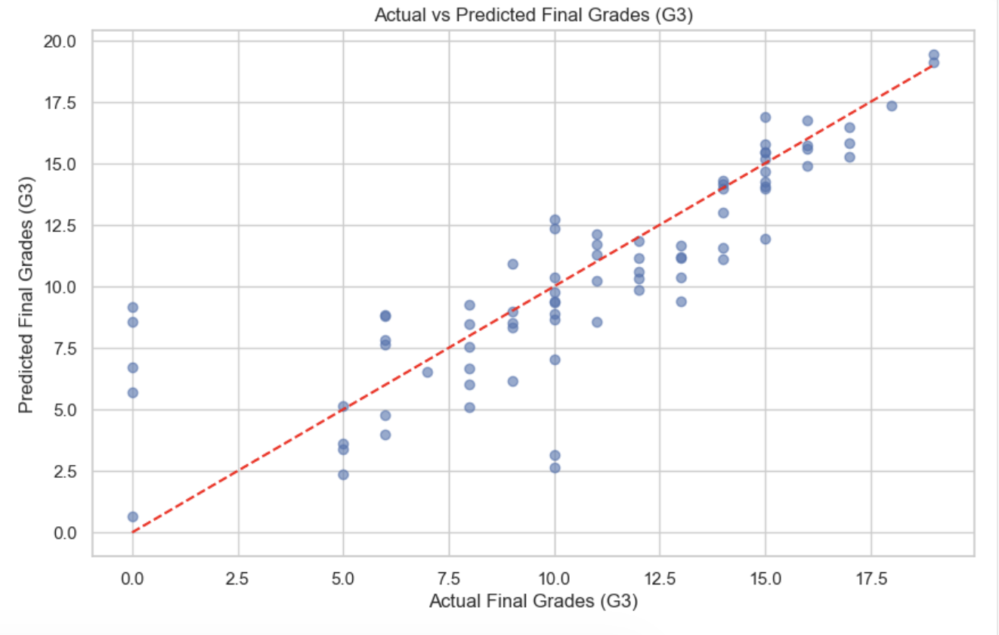
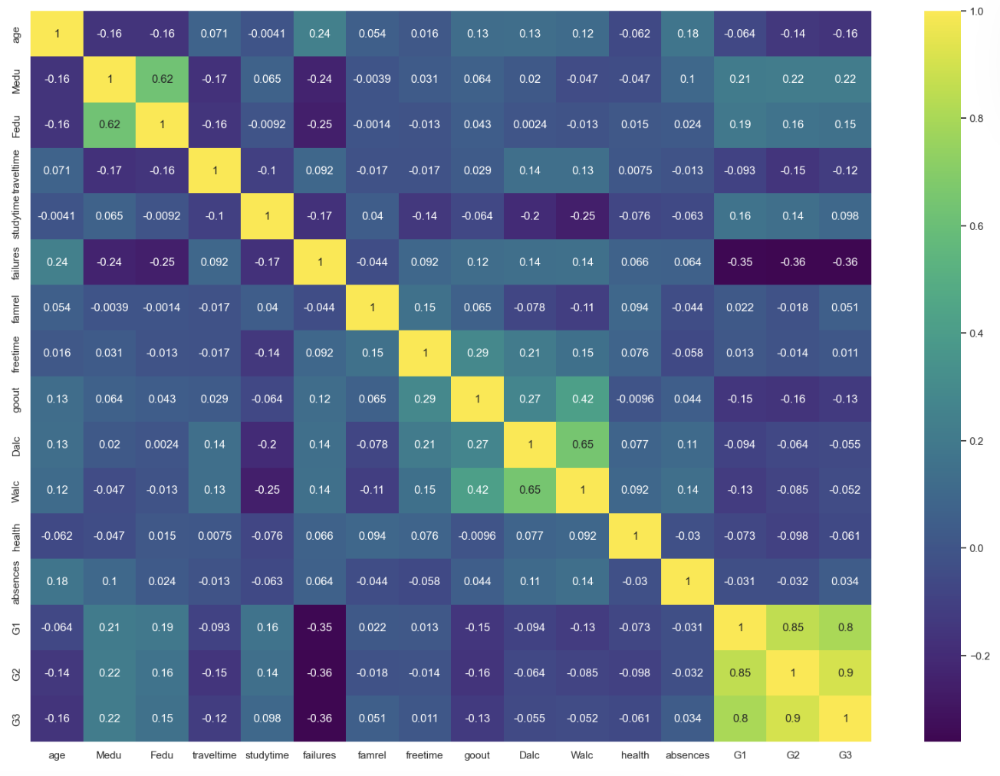
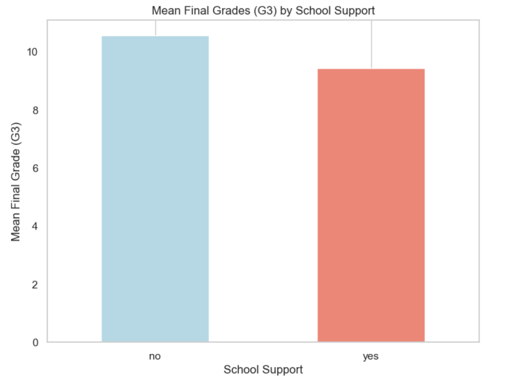
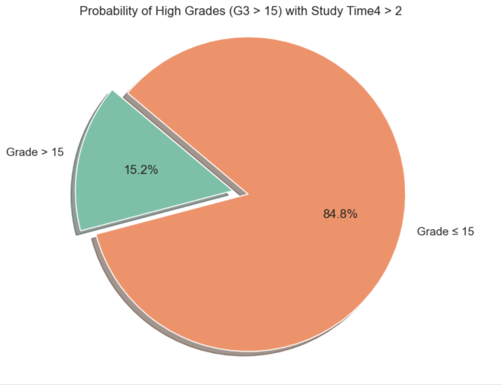

# Foundations of AI Project – Student Performance Prediction

This repository contains my coursework for **ECS8050 – Foundations of AI** at Queen’s University Belfast.  
The project applies fundamental mathematics of AI to the **UCI Student Performance dataset** (Mathematics track).

---

## 📊 Dataset
- Source: [UCI Repository – Student Performance](https://archive.ics.uci.edu/dataset/320/student+performance)  
- Records: 395 students  
- Features: demographics, parental background, study habits, behaviours, and three grade scores (G1, G2, G3).  
- Target: **Final Grade (G3)**  

---

## 🎯 Objective
To predict student academic performance and identify factors influencing success using:
- Probability & Statistics
- Linear Algebra (SVD)
- Optimisation (Gradient Descent, Hyperparameter tuning)
- Decision Theory (Markov Decision Process)

---

## 🔑 Methods
1. **Data Preparation**
   - Parsed dataset, handled categorical encoding, ensured clean structure (395×32).  

2. **Exploratory Data Analysis (EDA)**
   - Summary statistics, distributions, correlation heatmaps.  
   - Hypothesis testing (T-test, Chi-square).  

3. **Singular Value Decomposition (SVD)**
   - Reduced features, interpreted explained variance & loadings.  

4. **Optimisation**
   - Gradient Descent for Linear Regression.  
   - Hyperparameter tuning with Random Search.  

5. **Markov Decision Process (MDP)**
   - Defined performance states (Low, Medium, High).  
   - Actions: Study More, Reduce Distractions, Extra Activities.  
   - Value iteration → optimal student improvement policy.  

---

## 📈 Results & Visualisations

- **Correlation Findings**  
  - Failures strongly **negatively correlated** with G3 (r = -0.36).  
  - Study time weakly **positively correlated** (r ≈ 0.10).  

- **Visuals**  
    
    
    
    
    

- **Key Insight**:  
  - Students with **more study time and fewer failures** perform better.  
  - Probability of achieving **G3 > 15** if study time >2 hrs/week ≈ **15.2%**.  
  - MDP optimal policy suggests **“Study More”** as the best long-term action.  

---

## 📂 Repository Structure

│
├── notebooks/ # Jupyter Notebook with full analysis
├── report/ # Coursework report (PDF)
├── Results/figures/ # Plots and visualisations
├── requirements.txt # Dependencies
└── README.md # Project overview


---

## ⚖️ Ethical Considerations
- **Transparency**: Results explained clearly with visual evidence.  
- **Fairness**: Avoid bias when interpreting socio-economic factors.  
- **Privacy**: Dataset is anonymised and publicly available.  

---

## 🚀 How to Run
1. Clone this repo:
   ```bash
   git clone https://github.com/maheshnilewar/Foundation_Of_AI_Project.git
   cd Foundation_Of_AI_Project
2. Install dependencies:
   pip install -r requirements.txt
3. Run the notebook:
   jupyter notebook notebooks/student_performance_prediction.ipynb

References
GeeksforGeeks. Hyperparameter Tuning.
ECS8050 Lecture Notes, QUB.
